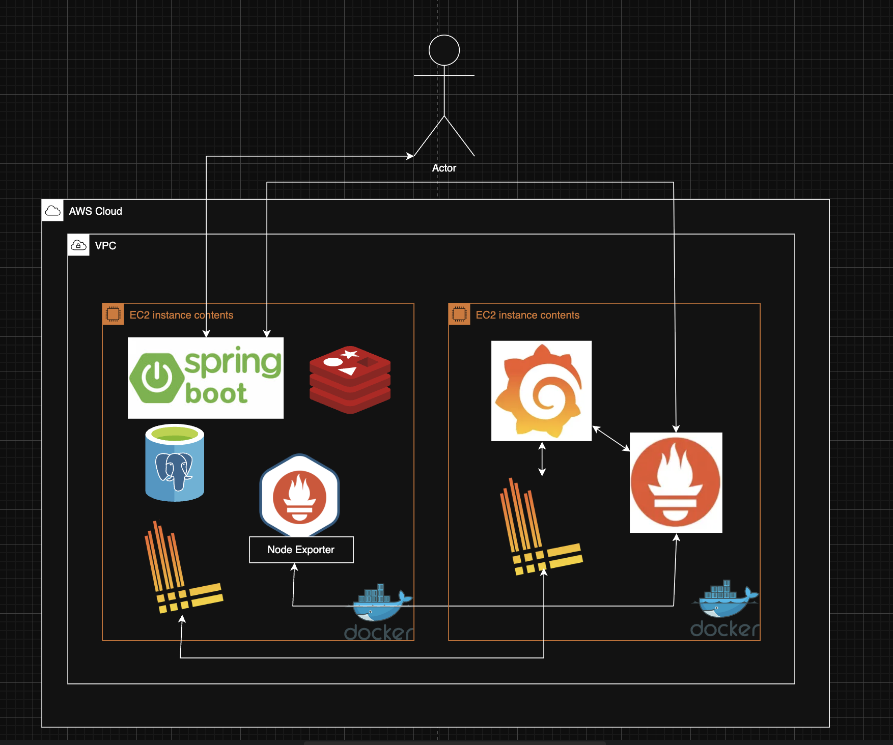
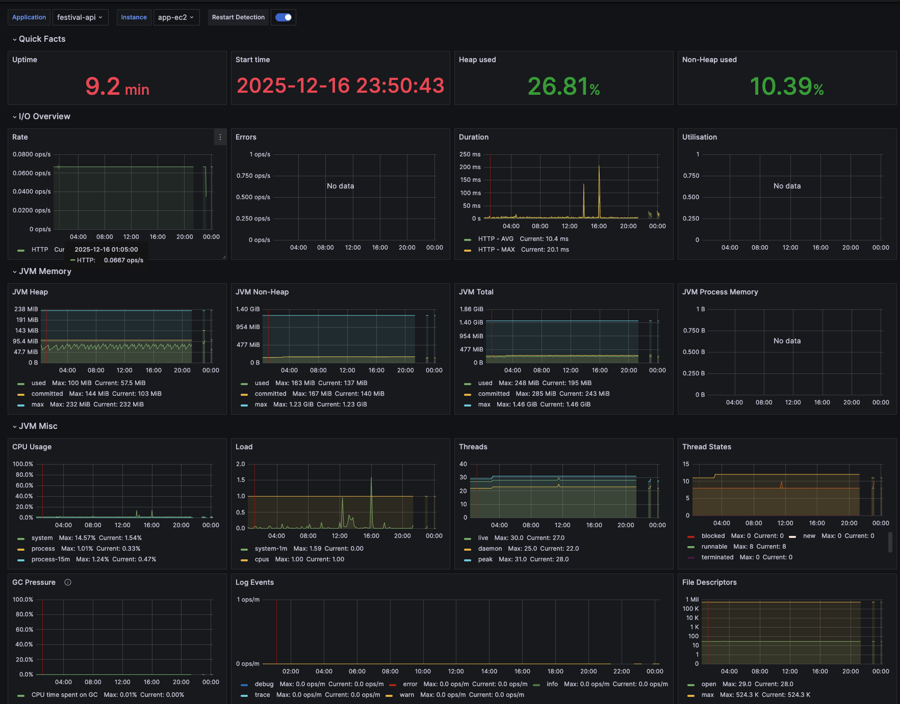
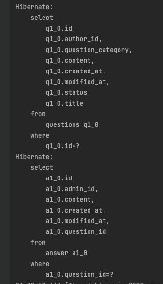
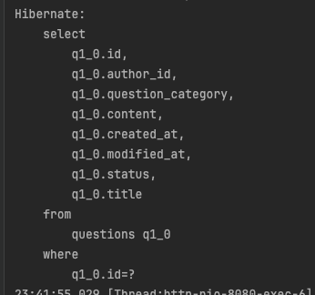
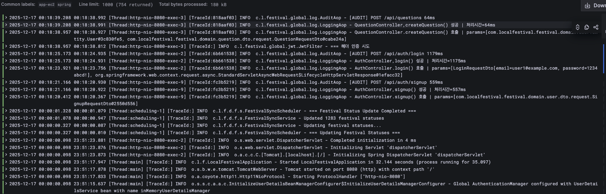

# 🎪 Local Festival (지역 축제 통합 관리 플랫폼)

 

## 📖 Project Overview
Local Festival은 전국 지역 축제 정보를 조회하고 참여할 수 있는 플랫폼입니다.
본 프로젝트는 비즈니스 로직의 양적 팽창보다는 **서버 성능 최적화, 모니터링 환경 구축, 트러블 슈팅** 등 **백엔드 코어 기술의 깊이 있는 학습과 적용**을 최우선 목표로 개발되었습니다.

---
## 📖 System Architecture

---
## 🛠 Tech Stack

| Category | Technology                                                         |
| :-- |:-------------------------------------------------------------------|
| **Language** | Java 17                                                            |
| **Framework** | Spring Boot 3.x, Spring Security, Spring Data JPA, QueryDSL        |
| **Database** | MySQL 8.0, Redis (refreshToken)                                    |
| **Infrastructure** | AWS EC2, Docker, Docker Compose|
| **Monitoring** | **PLG Stack** (Promtail, Loki, Grafana), Prometheus, Node Exporter |
| **Tools** | Swagger UI (API Docs), Postman, Git                                |

---

## 🔥 Technical Highlights (Key Achievements)
> **핵심 성과:** 성능 최적화 및 운영 환경 구축 경험

### 1. 모니터링 환경 구축 (PLG Stack)
* **배경:** AWS EC2 프리티어 환경의 제한된 리소스를 효율적으로 관제하고, 컨테이너 기반 환경에서의 로그 관리가 필요함.
* **해결:** 무거운 ELK Stack 대신 경량화된 **PLG Stack(Promtail, Loki, Grafana)**을 도입하여 실시간 로그 수집 및 시각화 환경 구축.
* **성과:** **JVM Heap Memory, Thread 상태, 실시간 에러 로그**를 통합 대시보드에서 관제 가능.
   
  

### 2. 조회 성능 최적화 (O(N) → O(1))
* **문제:** 대량의 축제 데이터 집계(`GROUP BY`) 시 Full Scan 발생으로 인한 성능 저하.
* **해결:** 실시간 집계 쿼리를 제거하고, **스케줄러**를 통해 통계 데이터를 미리 계산하여 저장하는 **Summary Table (역정규화)** 전략 도입.
* **성과:** 데이터 양과 무관하게 **일정한 조회 속도(O(1))** 보장.

### 3. OneToOne 관계 지연 로딩(Lazy) 미작동 이슈 해결
* **문제:** `FetchType.LAZY` 설정을 적용했으나, **`OneToOne` 양방향 관계의 프록시 생성 한계(Null 여부 확인 불가)**로 인해 지연 로딩이 무시됨. 이로 인해 메인 엔티티(`Question`) 조회 직후, 연관된 엔티티(`Answer`)를 찾기 위한 **추가적인 SELECT 쿼리가 강제로 실행**되는 현상 확인.
* **해결:** 양방향 매핑을 제거하고 **`ManyToOne` 단방향 관계**로 리팩토링하여 구조를 단순화함.
* **성과:** 의도치 않게 발생하던 **추가 SELECT 쿼리를 100% 제거**하여 조회 성능 최적화.

#### - Before (부모 테이블 조회시 불필요한 자식 테이블도 함께 조회)

#### - After (최적화 완료: 쿼리 1회로 감소)

### 4. 멀티 스레드 로그 추적 (MDC)
* **문제:** 다중 접속 환경에서 로그가 뒤섞여 특정 요청의 에러 원인을 파악하기 어려움.
* **해결:** MDC(Mapped Diagnostic Context)와 Servlet Filter를 활용하여 요청마다 고유한 **TraceID**를 부여.
* **성과:** 수많은 로그 속에서도 특정 트랜잭션의 전체 흐름을 완벽하게 추적 가능.
  

---

## 📚 API Documentation
프론트엔드와의 협업 및 테스트 편의성을 위해 **Swagger UI**를 도입하여 API 명세를 관리하고 있습니다.
 
